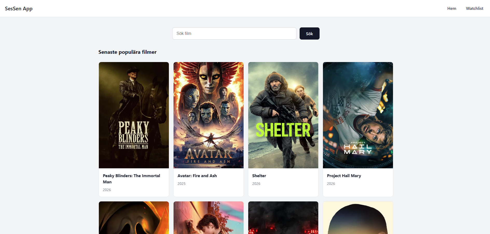
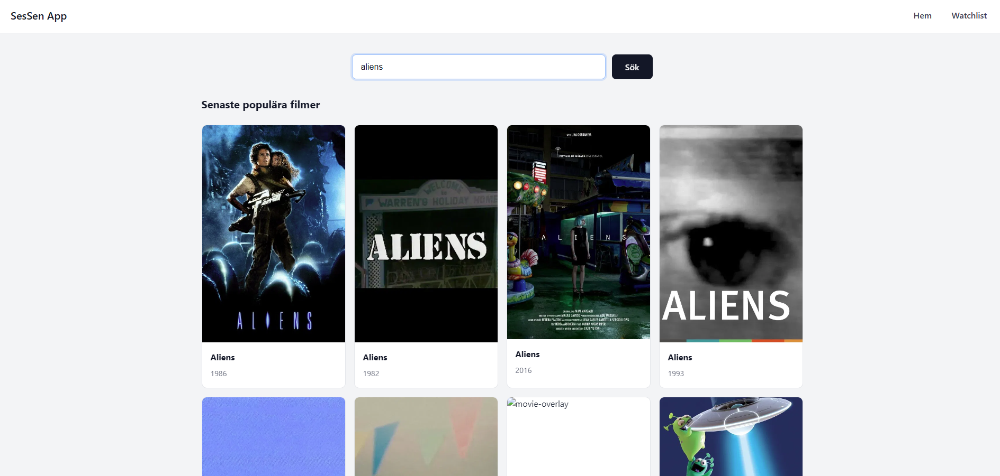
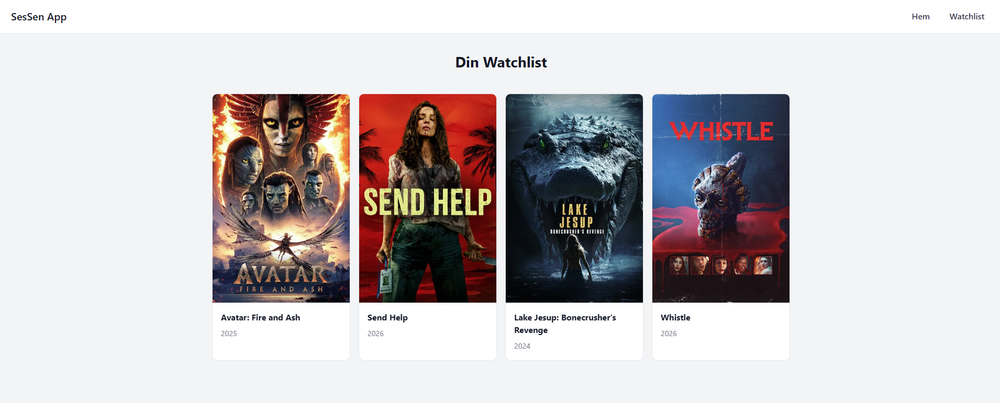

# Movie Watchlist App

A React movie watchlist application where users can browse popular movies, search for titles, and save movies to a watchlist.

## Features

- Browse popular movies from The Movie Database (TMDB)
- Search movies by title
- Add and remove movies from your watchlist
- Toggle watchlist status with a star icon
- Persist watchlist data in local storage
- Navigate between Home and Watchlist pages

## Tech Stack

- React
- React Router
- Vite
- CSS
- TMDB API

## Project Structure

```
movie-project/
	src/
		components/    # Reusable UI components (NavBar, MovieCard)
		context/       # Favorites state management with React Context
		pages/         # Route pages (Home, Favorites)
		services/      # API requests to TMDB
		css/           # Stylesheets
	screenshots/      # App screenshots used in this README
```

## Screenshots

Add your screenshots in the `movie-project/screenshots/` folder and keep these file names:

- Home page



- Search results



- Watchlist page



## Getting Started

1. Go to the app directory:

```bash
cd movie-project
```

2. Install dependencies:

```bash
npm install
```

3. Start the development server:

```bash
npm run dev
```

4. Open the app in your browser (Vite will show the local URL, usually `http://localhost:5173`).

## Available Scripts

- `npm run dev` - Start development server
- `npm run build` - Build for production
- `npm run preview` - Preview production build
- `npm run lint` - Run ESLint

## Notes

- Watchlist data is stored in browser local storage.
- The current UI text is mainly in Swedish.
